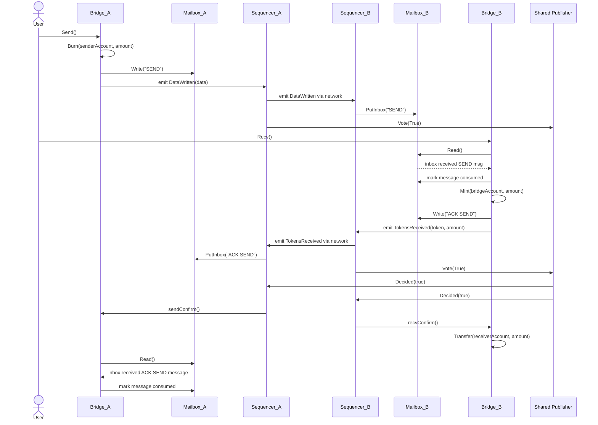
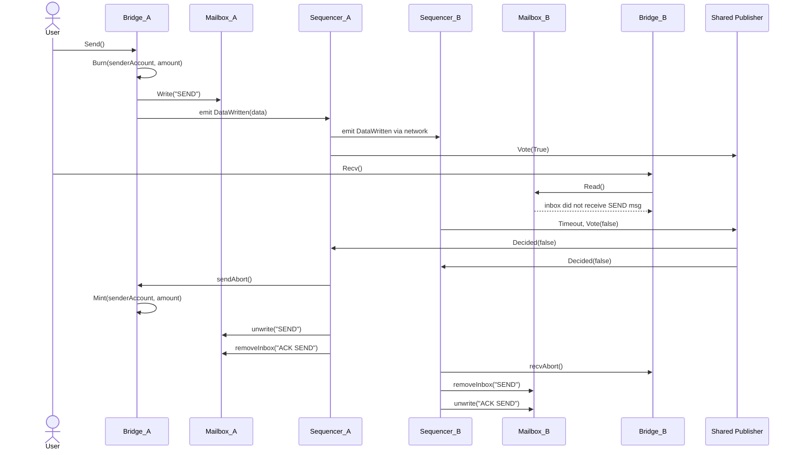

# Interleaved Bridge

This document describes an interleaved bridge, an added feature to the already developed smart contracts to increase the number of bridging processes that are executed between chains in a bounded amount of time.

## Table of Contents
- [Objectives](#objectives)
- [System Model](#system-model)
- [Properties](#properties)
- [Sequence Diagram](#sequence-diagram)
- [Bridge](#bridge)
- [Mailbox](#mailbox)

## Objectives
Having chains A, B and C transacting via a traditional bridge, a bridging process `p1` between chain A and B would have to finish until process `p2` between chain A and C could start, due to race conditions and the possibility of incorrect states, which limits the number of bridging transactions that are executed in a fixed period of time.
With the proposed feature all bridging processes will be divided into several steps, employing a Saga pattern, which allows `p1` and `p2` to run interleaved. Steps of `p1` are executed before/after steps of `p2`.

The execution of functions for token transfer generates messages to inform the rest of the network of the state of the bridging process. These messages are stored in a mailbox smart contract, to be consumed either by sequencers, or by bridge functions.

This implementation aims to achieve the following objectives:

- [ ] Maintain the main bridge functionality of token exchange between accounts of different chains
- [ ] Allow sequencers (and only these) to abort incorrect / confirm correct bridging processes
- [ ] Minting, burning and transfer of tokens by multiple steps of a bridging process must not leave user accounts inconsistent for the next bridging processes
- [ ] Ensure that multiple bridging processes producing messages does not leave mailboxes in an inconsistent state
- [ ] Increase the amount of bridging processes executed in a defined amount of time to be greater than a serial execution

## System Model
The system that will interact with this smart contract consists of the following components:

- Users: these are clients that want to transfer tokens from one chain to another, making use of functions `send` and `recv`.
- Sequencers: also known as coordinators, are responsible for confirming/aborting the execution of bridging processes between chains. These components make use of functions `recvConfirm`, `recvAbort`, `sendConfirm`, and `sendAbort`.
- Shared Publisher: the main entity, assumed as a trustable, responsible for coordinating sequencers when executing bridging processes. This component informs sequencers whether to confirm/abort the inclusion of bridging processes.

## Properties

| Property        |                                                                              Description                                                                               |
|-----------------|:----------------------------------------------------------------------------------------------------------------------------------------------------------------------:|
| Compensability  | All unconfirmed bridging processes can be aborted, resulting in a compensating action that aims to cancel the actions performed by the previously executed transaction |
| Observability   |                All executed bridge functions emit events that can be observed by any component of the ethereum network, resulting in a verifiable trail                |
| Serializability |                             Executing interleaved bridging processes produces the same result as executing bridging processes sequentially                             |
| Atomicity       |        Each bridging process has an atomic final outcome: it is either fully confirmed or fully compensated (aborted), never partially committed at completion.        |
| Termination     |                                    Every initiated bridging process eventually reaches a terminal decision (confirmed or aborted).                                     |


## Sequence Diagram

The user signs two transactions, the sending of tokens from one chain, and the receiving on tokens on the other. This can be seen in the following sequence diagrams where we have a user sending tokens from chain A to chain B. In the first diagram, the shared publisher validates the whole transaction. With a decided value of true, the sequencers of each chain will confirm the changes that resulted from the initial `send` and `recv` functions. In contrast, in the second diagram, the shared publisher invalidates the previous execution, causing sequencers to execute compensating actions to remove the messages that were stored in the mailboxes, as well as returning the tokens to the user's account on chain A.

Sequence Diagram Success Case:


Sequence diagram Failure Case:



## Bridge

```
Constants:
    SEND_TAG      ← "SEND"
    ACK_SEND_TAG  ← "ACK SEND"
    ACK_OK        ← "OK"

State Variables:
    mailbox                     // Immutable mailbox interface
    COORDINATOR                 // Immutable coordinator address

Guards:
    onlyCoordinator():
        if caller != COORDINATOR:
            fail InvalidCoordinator

Procedure Constructor(_mailbox, _coordinator):
    mailbox ← _mailbox
    COORDINATOR ← _coordinator

Procedure Send(otherChainId, token, sender, receiver, amount, sessionId, destBridge):
    if caller != sender:
        fail Unauthorized

    call token.burn(sender, amount)

    data ← encode(sender, receiver, token, amount)

    call mailbox.write(
        otherChainId,
        destBridge,
        sessionId,
        SEND_TAG,
        data
    )

    emit DataWritten(data)

Procedure SendAbort(token, sender, amount):
    onlyCoordinator()

    call token.mint(sender, amount)

    emit TokensReturned(token, amount)

Procedure Recv(otherChainId, sender, receiver, sessionId, srcBridge) returns (token, amount):
    if caller != receiver:
        fail Unauthorized

    message ← mailbox.read(
        otherChainId,
        srcBridge,
        sessionId,
        SEND_TAG
    )

    if message is empty:
        fail EmptySourceChainMessage

    (readSender, readReceiver, token, amount) ← decode(message)

    if readSender != sender:
        fail SenderMismatch

    if readReceiver != receiver:
        fail ReceiverMismatch

    call token.mint(this_contract, amount)

    ackMessage ← encode(ACK_OK)

    call mailbox.write(
        otherChainId,
        srcBridge,
        sessionId,
        ACK_SEND_TAG,
        ackMessage
    )

    emit TokensReceived(token, amount)

    return (token, amount)

Procedure RecvConfirm(otherChainId, sender, receiver, sessionId, srcBridge):
    onlyCoordinator()

    message ← mailbox.read(
        otherChainId,
        srcBridge,
        sessionId,
        SEND_TAG
    )

    if message is empty:
        fail EmptySourceChainMessage

    (readSender, readReceiver, token, amount) ← decode(message)

    if readSender != sender:
        fail SenderMismatch

    call token.transfer(receiver, amount)

    emit TokensDelivered(token, amount)

Procedure RecvAbort(otherChainId, sender, receiver, sessionId, srcBridge):
    onlyCoordinator()

    message ← mailbox.read(
        otherChainId,
        srcBridge,
        sessionId,
        SEND_TAG
    )

    if message is empty:
        fail EmptySourceChainMessage

    (readSender, readReceiver, token, amount) ← decode(message)

    if readSender != sender:
        fail SenderMismatch

    call token.burn(bridge, amount)
    
    emit TokensReturned(token, amount)

Procedure CheckAck(chainDest, destBridge, sessionId) returns ack:
    ack ← mailbox.read(
        chainDest,
        destBridge,
        sessionId,
        ACK_SEND_TAG
    )
    return ack
```

### Previous Send

The sending of tokens between chains is currently implemented by burning the specified amount from the user's account, writing a mailbox message to the outbox of the sending chain, and emitting an event that will be picked up by the sequencer of the other chain. As there is no possibility of going back, these changes are permanent to the mailbox.

### Send

The proposed update maintains the same `send` function when saving changes. However, new methods have been added to allow sequencers to rewind and remove the changes that were originated by this function.

### Send Confirm

To confirm the sending of tokens, the ack send message will be consumed from the inbox of the sender, to verify that these tokens were received by the other chain.

### Send Abort

To abort the sending of tokens, the tokens that were initially burned will be minted to be returned to the user's account. An event will also be transmitted, to inform the ethereum network that the tokens have been returned to the sender.

### Previous Receive

The receiving of tokens between chains is currently implemented by reading the message that was previously saved in the inbox by the sequencer and doing some security checks (whether the address of the sending account and the recipient account in the message are the same as the ones specified by the user when calling this function). With all conditions validated, the specified amount will be minted to the user's account in the receiving chain, and an outbox message will be written to acknowledge the sending of tokens. Lastly, a "tokens received" event will be emitted to inform the sequencer of the sending chain.

### Receive

The proposed update maintains the same `recv` when saving changes. However, there is a slight update to this method where instead of minting the tokens directly to the user's account, this amount is minted to the bridge's account. Only when the receiving is later verified by the shared publisher, will this amount be transferred to the user's account. As such, changes saved by this function are not definitive until a confirm method is executed, as there are new methods to rewind and remove them. 

### Receive Confirm

The mailbox message that was sent will once again be read, but this time the details are extracted to transfer the specified amount to the user's account. Lastly a "tokens delivered" event is created to inform the ethereum network.

### Receive Abort

The previously minted tokens will now be burned from the bridge's account as these won't be used to fulfill the transfer. Lastly a "tokens returned" event is emitted to inform the network.

## Mailbox

```
Constants:
    ZERO_HASH ← bytes32(0)

State Variables:
    COORDINATOR                         // immutable trusted coordinator

    chainIDsInbox ← []                  // chain IDs currently with non-zero inbox root
    chainIDsOutbox ← []                 // chain IDs currently with non-zero outbox root

    inboxRootPerChain[chainId]          // xor-accumulated root for inbox messages per source chain
    outboxRootPerChain[chainId]         // xor-accumulated root for outbox messages per destination chain

    inbox[key]                          // key -> message bytes
    outbox[key]                         // key -> message bytes
    createdKeys[key]                    // key existence tracker (in inbox/outbox)

    messageHeaderListInbox ← []         // list of MessageHeader for inbox entries
    messageHeaderListOutbox ← []        // list of MessageHeader for outbox entries

Guards:
    onlyCoordinator():
        if caller != COORDINATOR:
            fail InvalidCoordinator

Procedure Constructor(_coordinator):
    COORDINATOR ← _coordinator

 /// Creates and returns a unique key for a message based on its details.
 /// This key is a hash of all the message parts, used to store and find messages.
 /// @param chainMessageSender The ID of the chain sending the message.
 /// @param chainMessageRecipient The ID of the chain receiving the message.
 /// @param sender The address sending the message.
 /// @param receiver The address receiving the message.
 /// @param sessionId A unique number for the session.
 /// @param label A tag to tell different actions apart in the same session.
 /// @return key The unique hash key for the message.
Procedure GetKey(chainMessageSender, chainMessageRecipient, sender, receiver, sessionId, label) returns key:
    key ← keccak256(
        encodePacked(
            chainMessageSender,
            chainMessageRecipient,
            sender,
            receiver,
            sessionId,
            label
        )
    )
    return key

 /// Reads a message from the inbox.
 /// Anyone can read messages. Function checks if the message exists and throws if it does not.
 /// @param chainMessageSender The ID of the chain that sent the message.
 /// @param sender The address that sent the message.
 /// @param sessionId The session number.
 /// @param label The tag for the action.
 /// @return message The data of the message.
Procedure Read(chainMessageSender, sender, sessionId, label) returns message:
    key ← GetKey(
        chainMessageSender,
        currentChainId,
        sender,
        caller,
        sessionId,
        label
    )

    if inbox[key] is empty AND createdKeys[key] == false:
        fail MessageNotFound

    return inbox[key]

/// Writes a message to the outbox to send to another chain.
/// Any contract can write to the outbox. It creates a key, stores the data, and updates the outbox root.
/// @param chainMessageRecipient The ID of the chain receiving the message.
/// @param receiver The address that will receive the message.
/// @param sessionId The session number.
/// @param label The tag for the action.
/// @param data The message data to send.
Procedure Write(chainMessageRecipient, receiver, sessionId, label, data):
    key ← GetKey(
        currentChainId,
        chainMessageRecipient,
        caller,
        receiver,
        sessionId,
        label
    )

    outbox[key] ← data
    createdKeys[key] ← true

    messageHeaderListOutbox.push(
        (currentChainId, chainMessageRecipient, caller, receiver, sessionId, label)
    )

    if outboxRootPerChain[chainMessageRecipient] == ZERO_HASH:
        chainIDsOutbox.push(chainMessageRecipient)

    outboxRootPerChain[chainMessageRecipient] ←
        outboxRootPerChain[chainMessageRecipient] XOR keccak256(encode(key, data))

    emit NewOutboxKey(lastIndex(messageHeaderListOutbox), key)


/// Removes a previously written message from the outbox.
/// Executed by the coordinator. Marks the key as unused, removes the data and updates the outbox root.
/// @param chainMessageRecipient The ID of the chain receiving the message.
/// @param receiver The address that will receive the message.
/// @param sessionId The session number.
/// @param label The tag for the action.
/// @param data The message data to send.
Procedure Unwrite(chainMessageRecipient, sender, receiver, sessionId, label, data):
    onlyCoordinator()

    key ← GetKey(
        currentChainId,
        chainMessageRecipient,
        sender,
        receiver,
        sessionId,
        label
    )

    if outbox[key] is empty AND createdKeys[key] == false
       AND hash(outbox[key]) != hash(data):
        fail MessageNotFound

    delete outbox[key]
    createdKeys[key] ← false

    // Remove matching header via swap-and-pop (order not preserved)
    for i in [0 .. len(messageHeaderListOutbox)-1]:
        if HeaderEquals(
            messageHeaderListOutbox[i],
            currentChainId,
            chainMessageRecipient,
            sender,
            receiver,
            sessionId,
            label
        ):
            messageHeaderListOutbox[i] ← last(messageHeaderListOutbox)
            messageHeaderListOutbox.pop()
            break

    outboxRootPerChain[chainMessageRecipient] ←
        outboxRootPerChain[chainMessageRecipient] XOR keccak256(encode(key, data))

    // If root becomes zero, remove chain ID via swap-and-pop
    if outboxRootPerChain[chainMessageRecipient] == ZERO_HASH:
        for i in [0 .. len(chainIDsOutbox)-1]:
            if chainIDsOutbox[i] == chainMessageRecipient:
                chainIDsOutbox[i] ← last(chainIDsOutbox)
                chainIDsOutbox.pop()
                break

    emit DeletedOutboxMessage(key)

/// Adds a message to the inbox. Only the coordinator can do this.
/// This is for incoming messages from other chains. It updates the inbox root.
/// @param chainMessageSender The ID of the chain that sent the message.
/// @param sender The address that sent it.
/// @param receiver The address receiving it.
/// @param sessionId The session number.
/// @param label The tag for the action.
/// @param data The message data.
Procedure PutInbox(chainMessageSender, sender, receiver, sessionId, label, data):
    onlyCoordinator()

    key ← GetKey(
        chainMessageSender,
        currentChainId,
        sender,
        receiver,
        sessionId,
        label
    )

    inbox[key] ← data
    createdKeys[key] ← true

    messageHeaderListInbox.push(
        (chainMessageSender, currentChainId, sender, receiver, sessionId, label)
    )

    if inboxRootPerChain[chainMessageSender] == ZERO_HASH:
        chainIDsInbox.push(chainMessageSender)

    inboxRootPerChain[chainMessageSender] ←
        inboxRootPerChain[chainMessageSender] XOR keccak256(encode(key, data))

    emit NewInboxKey(lastIndex(messageHeaderListInbox), key)

/// Removes a message to the inbox. Only the coordinator can do this.
/// This is for incoming messages from other chains. It updates the inbox root.
/// @param chainMessageSender The ID of the chain that sent the message.
/// @param sender The address that sent it.
/// @param receiver The address receiving it.
/// @param sessionId The session number.
/// @param label The tag for the action.
/// @param data The message data.
Procedure RemoveInbox(chainMessageSender, sender, receiver, sessionId, label, data):
    onlyCoordinator()

    key ← GetKey(
        chainMessageSender,
        currentChainId,
        sender,
        receiver,
        sessionId,
        label
    )

    if inbox[key] is empty AND createdKeys[key] == false
            AND hash(inbox[key]) != hash(data):
        fail MessageNotFound

    delete inbox[key]
    createdKeys[key] ← false

    // Remove matching header via swap-and-pop (order not preserved)
    for i in [0 .. len(messageHeaderListInbox)-1]:
        if HeaderEquals(
            messageHeaderListInbox[i],
            chainMessageSender,
            currentChainId,
            sender,
            receiver,
            sessionId,
            label
        ):
            messageHeaderListInbox[i] ← last(messageHeaderListInbox)
            messageHeaderListInbox.pop()
            break

    inboxRootPerChain[chainMessageSender] ←
        inboxRootPerChain[chainMessageSender] XOR keccak256(encode(key, data))

    // If root becomes zero, remove chain ID via swap-and-pop
    if inboxRootPerChain[chainMessageSender] == ZERO_HASH:
        for i in [0 .. len(chainIDsInbox)-1]:
            if chainIDsInbox[i] == chainMessageSender:
                chainIDsInbox[i] ← last(chainIDsInbox)
                chainIDsInbox.pop()
                break

    emit DeletedInboxMessage(key)

Procedure HeaderEquals(h, chainSrc, chainDest, sender, receiver, sessionId, label) returns bool:
    if h.chainSrc   != chainSrc:   return false
    if h.chainDest  != chainDest:  return false
    if h.sender     != sender:     return false
    if h.receiver   != receiver:   return false
    if h.sessionId  != sessionId:  return false
    if hash(h.label) != hash(label): return false
    return true

Procedure ComputeKey(id) returns key:
    if id >= len(messageHeaderListInbox):
        fail InvalidId

    m ← messageHeaderListInbox[id]

    key ← keccak256(
        encodePacked(
            m.chainSrc,
            m.chainDest,
            m.sender,
            m.receiver,
            m.sessionId,
            m.label
        )
    )
    return key
```

### Read

Equal to the original read function, used by bridges when fetching previously stored messages from the inbox. The key of the message is generated according to parameters of the bridging process, and if the message is found, it will be returned.

### Write

Method used to write a message to the outbox of a chain that will be received by another chain. Equal to the original function.

### Unwrite

Method used to remove a message related with a bridging process that was aborted. This function can be called only by the sequencer. For the removal of a message to work properly, there are some verifications, such as ensuring that the message that is going to be deleted is indeed stored in the outbox with the given key, ensuring that the key was marked as generated, as finally, ensuring that the content of the message has the same content as the message that we're trying to delete. After these verifications, the message is deleted from the outbox, the key is marked as not generated, and a xor with the message with done once again to redact the previous changes. There are also two for loops, one responsible for removing the messageHeader from an array of message headers (search position and replace with the last position of the array), and another to remove the xor chain of hashes if there are no more messages left in the chain.

### putInbox

Equal to the original function, adds a new message to the inbox of a chain. Can only be executed by the sequencer.

### removeInbox

Follows the same rationale as the unwrite method. However, instead of removing from the outbox, this function removes a message from the inbox of a chain.

